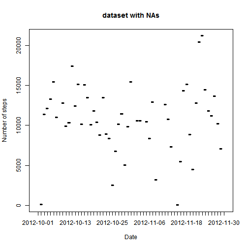
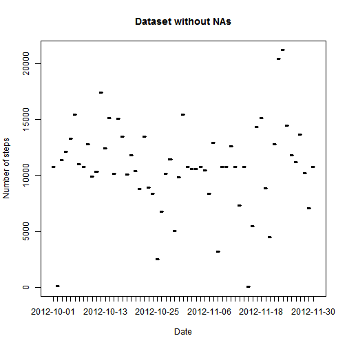

# Reproducible Research: Peer Assessment 1


```r
library(knitr)
## Loading and preprocessing the data
data <- read.csv("activity.csv")
```


```r
## What is mean total number of steps taken per day?
sum_day <- aggregate(data$steps, by = list(data$date), sum)
plot(sum_day, type = "h", xlab = "Date", ylab = "Number of steps", main = "dataset with NAs")
```

 

```r

mean_day <- aggregate(data$steps, by = list(data$date), mean)

median_day <- aggregate(data$steps, by = list(data$date), median)
```


```r
## What is the average daily activity pattern?
int_day <- aggregate(as.numeric(data$steps), by = list(as.numeric(data$interval)), 
    mean, na.action = na.omit)

max <- max(int_day$x)
for (i in 1:length(int_day$x)) {
    if (int_day$x[i] == max) 
        max_place <- i
}
```

```
## Error: missing value where TRUE/FALSE needed
```


```r
## Imputing missing values
missing <- sum(is.na(data))
mn <- round(mean(mean_day$x, na.rm = TRUE), 2)
data$steps[is.na(data$steps)] = mn

sum_day2 <- aggregate(data$steps, by = list(data$date), sum)

plot(sum_day2, type = "h", xlab = "Date", ylab = "Number of steps", main = "Dataset without NAs")
```

 

```r
mean_day2 <- aggregate(data$steps, by = list(data$date), mean)
median_day2 <- aggregate(data$steps, by = list(data$date), median)
```


```r
## Are there differences in activity patterns between weekdays and
## weekends?
library(lattice)
```

```
## Warning: package 'lattice' was built under R version 2.15.3
```

```r
dy <- weekdays(as.Date(data$date))
days = c(1:length(dy))
for (i in 1:length(dy)) ifelse(dy[i] == "Saturday" || dy[i] == "Sunday", days[i] <- c("Weekend"), 
    days[i] <- c("Weekday"))

wk <- data.frame(data, days)
wk$days <- as.factor(wk$days)
xyplot(wk$steps | wk$days, data = wk, layout = c(1, 2))
```

```
## Warning: | not meaningful for factors
```

```
## Error: no applicable method for 'xyplot' applied to an object of class
## "logical"
```


